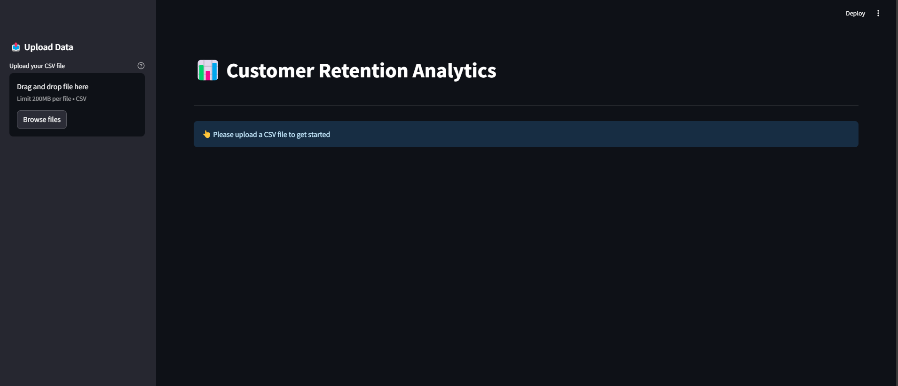
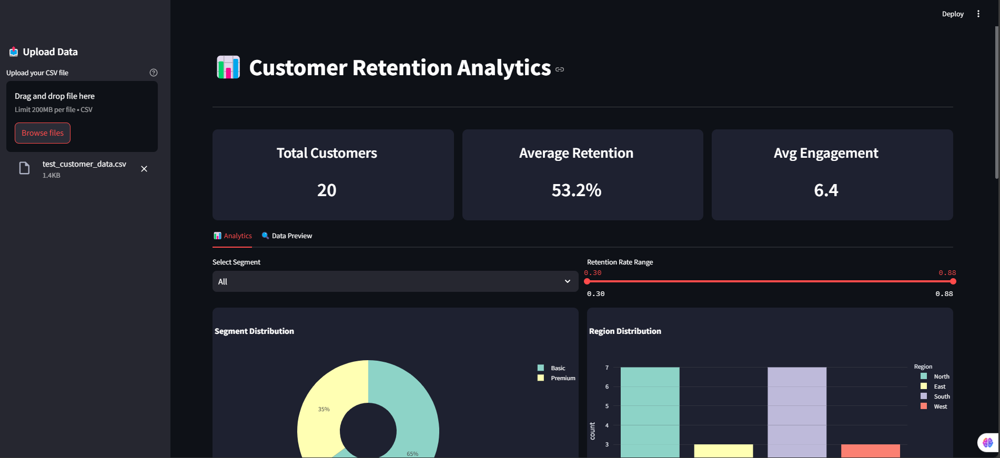
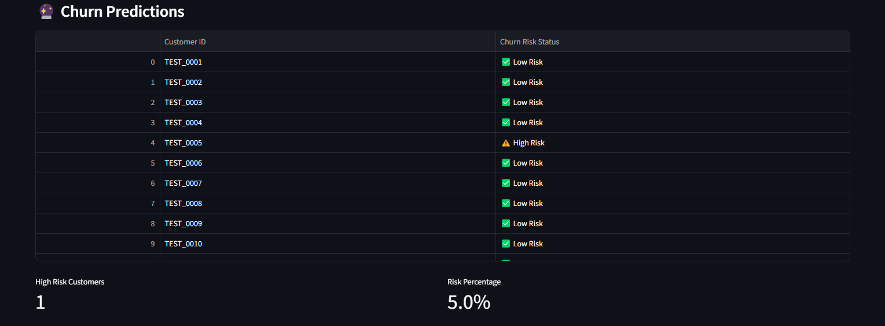

# Customer Retention Analytics

Customer Retention Analytics is a project designed to analyze customer data, predict churn probabilities, and visualize key retention metrics. This tool combines a powerful backend with an interactive dashboard to empower businesses with actionable insights.

---

## Features

### 1. **Data Analysis**
- Upload customer data (CSV format).
- Automated summary of the dataset, including missing values, data types, and basic statistics.

### 2. **Churn Prediction**
- Predict customer churn using a pre-trained machine learning model.
- Automatically encodes categorical variables.

### 3. **Interactive Dashboard**
- Dynamic visualizations for customer segmentation, retention rate trends, and engagement scores.
- Intuitive filtering options for tailored analytics.
- Metrics cards for key performance indicators (KPIs).

---

## Folder Structure

```plaintext
.
├── data
│   ├── customer_data.csv
│   └── churn_prediction_model.pkl
├── analyze_data.py
├── backend.py
├── dashboard.py
└── README.md
```

---

## Installation

1. **Clone the Repository**:
   ```bash
   git clone https://github.com/DhruvSharma-05/Customer-Retention-Analytics.git
   cd customer-retention-analytics
   ```

2. **Install Dependencies**:
   ```bash
   pip install -r requirements.txt
   ```

3. **Run the Backend Server**:
   ```bash
   python backend.py
   ```

4. **Launch the Dashboard**:
   ```bash
   streamlit run dashboard.py
   ```

---

## API Endpoints
### `/get_data` (GET)
- Retrieves customer data as JSON.
- **Usage**: `curl http://localhost:5000/get_data`
### `/predict_churn` (POST)
- Predicts churn based on customer data.
- **Payload Example**:
```json
[
	    {
	      "Segment": "Gold",
	      "Retention_Rate": 0.85,
	      "Engagement_Score": 78,
	      "Region": "North"
	    }
]
 ```
- **Response Example**:
```json
	  [
	    { "Churn_Prediction": 0 }
	  ]
```
---

## Technologies Used

- **Python**: Core language for data analysis and backend logic.
- **Flask**: Backend framework for API creation.
- **Streamlit**: Frontend library for interactive dashboards.
- **Plotly**: Data visualization library for creating charts.
- **Pandas**: Data manipulation and analysis.
- **Scikit-learn**: Machine learning for churn prediction.

---

## Highlights

### Backend
- **File**: `backend.py`
- Loads the pre-trained churn prediction model (`churn_prediction_model.pkl`).
- Handles data preprocessing and prediction.

### Dashboard
- **File**: `dashboard.py`
- Offers an interactive interface for uploading and exploring data.
- Displays dynamic visualizations with customizable filters.
- Provides a dark-themed, responsive UI.

### Data Analysis
- **File**: `analyze_data.py`
- Summarizes uploaded data, highlighting missing values and descriptive statistics.

---

## Future Enhancements

1. **Real-Time Analytics**: Integration with real-time data streams.
2. **Advanced Visualizations**: Add Sankey charts and customer lifetime value metrics.
3. **Enhanced Model**: Train a more robust model with larger datasets.
4. **User Authentication**: Secure access to the dashboard.

---

## Screenshots

### Dashboard Overview

[Dashboard Screenshot]




### Churn Prediction Results

[Prediction Results]


---

## Contributing

1. Fork the repository.
2. Create a feature branch (`git checkout -b feature-name`).
3. Commit your changes (`git commit -m 'Add feature-name'`).
4. Push to the branch (`git push origin feature-name`).
5. Open a Pull Request.


## Contact

For any queries or suggestions, reach out to:

- **Name**: Dhruv Sharma
- **Email**: dhruv.sharma1592@gmail.com
- **GitHub**: [github.com/dhruv-sharma](https://github.com/DhruvSharma-05)
